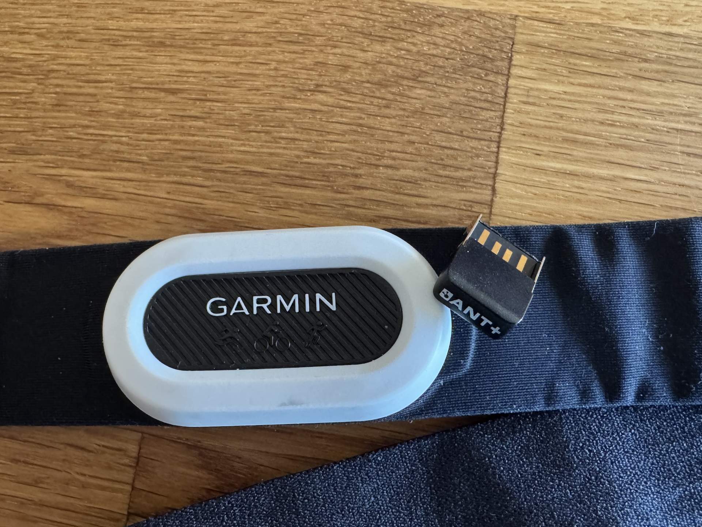

# HeartStrapAnalysis

This repository is meant to a be a quick tool to test your ANT+ based heart strap and its communication drop rate. An ANT+ USB device picks up the communication signal from the heartstrap which, once put on a persons chest and activated, emits broadcast data at a frequency of about four times a second.
<center></center>

 Here we use the [openant](https://github.com/Tigge/openant/tree/master) python based library to assist in picking up the signals from the strap in the USB ANT+ device.
 
 ## Experiment setup:
 
 When running `python3 script.py`, the code will connect to the strap and print the strap broadcast summary:
 
 ```
1310: HeartRateData(page_specific=6083328, beat_time=24.015625, beat_count=250, heart_rate=62, operating_time=623064, manufacturer_id_lsb=1, serial_number=52701, previous_heart_beat_time=23.2060546875, battery_percentage=255)
1311: Running for 390.839 seconds with 1589 expected communications. Skipped communications: 932. Recieved communications: 656.

1312: HeartRateData(page_specific=6295552, beat_time=24.84765625, beat_count=251, heart_rate=63, operating_time=623064, manufacturer_id_lsb=1, serial_number=52701, previous_heart_beat_time=24.015625, battery_percentage=255)
1313: Running for 391.086 seconds with 1590 expected communications. Skipped communications: 932. Recieved communications: 657.

1314: HeartRateData(page_specific=6295552, beat_time=24.84765625, beat_count=251, heart_rate=63, operating_time=623064, manufacturer_id_lsb=1, serial_number=52701, previous_heart_beat_time=24.015625, battery_percentage=255)
1315: Running for 391.578 seconds with 1592 expected communications. Skipped communications: 933. Recieved communications: 658.

1316: HeartRateData(page_specific=6513664, beat_time=25.5908203125, beat_count=252, heart_rate=64, operating_time=623064, manufacturer_id_lsb=1, serial_number=52701, previous_heart_beat_time=24.84765625, battery_percentage=255)
1317: Running for 391.824 seconds with 1593 expected communications. Skipped communications: 933. Recieved communications: 659.
```

The lines are organized in groups of two by communication event from the strap. Lines `1310` and `1311` are for `beat_count=250` while `1312`, `1313` and `1314`,`1315` are for `beat_count=251` and the last two lines are for `beat_count=252`. An identical beat count (as in the case of `beatcount=251`) means that the strap communicated the same data as there was no new heart beat so it just sends the same data at the rate of about four times a second.

We observe that for line `1311` and `1313` we have that `Skipped communications: 932` is static meaning that there was no skipped communication. However, for line `1315` it is now `Skipped communications: 933.` Furtheremore, the difference between `Running for X seconds` between `1311` and `1313` is `391.086 - 390.839 = 247` milliseconds which is the expected difference for a four times a second communication rate. However, between `1315` and `1313` it is `391.578 - 391.086 = 492` millseconds. which means there was a skip of communications from the strap which explains the jump by one in `Skipped communications: 933.`

The `1593 expected communications` in `Running for 391.824 seconds with 1593 expected communications` is computed by the total run time of the experiment (`391.824`) divided by the expected frequency of communication which is every `246` milliseconds (`4.06Hz`). The expected communication number with respect to `Skipped communications: 933` allows us to compute that we have a `933/1593` skip rate which is about `59%` rate. `59%` of our packets are dropped.

## Drop rate investigation

I was confused by the drop rate. I ended up doing some investigation under an existing openat github library [issue](https://github.com/Tigge/openant/issues/111#issuecomment-2672828117). There I discovered that repeat events were not processed which explains the high drop rate. I made some modifications to the repository to allow for repeat events in my fork https://github.com/mannyray/openant and reran the experiment and got a lower drop rate of `105/800 = 12%`:

```
1387: Running for 196.766 seconds with 800 expected communications. Skipped communications: 105. Recieved communications: 694.
```

The modification in the repository was to allow duplicate events to come in ( see [here](https://github.com/mannyray/openant/commit/a19c1a5cd0153a9a02c11021186b4dd8b2b296cd)). In addition, I added a log `print("about to broadcast")`, and noticed that everytime `script.py` was outputting an increase of `Skipped communications`, I was double logging `about to broadcast` meaning that the data was correctly recieved by the ANT+ USB but the `script.py` did not recieve it:

```
about to broadcast
110: HeartRateData(page_specific=13506816, beat_time=52.416015625, beat_count=109, heart_rate=68, operating_time=16777215, manufacturer_id_lsb=255, serial_number=65535, previous_heart_beat_time=51.5244140625, battery_percentage=255)
111: Running for 16.003 seconds with 65 expected communications. Skipped communications: 10. Recieved communications: 56.

about to broadcast
about to broadcast
112: HeartRateData(page_specific=13506816, beat_time=52.416015625, beat_count=109, heart_rate=68, operating_time=16777215, manufacturer_id_lsb=255, serial_number=65535, previous_heart_beat_time=51.5244140625, battery_percentage=255)
113: Running for 16.496 seconds with 67 expected communications. Skipped communications: 11. Recieved communications: 57.

about to broadcast
114: HeartRateData(page_specific=13740544, beat_time=53.2783203125, beat_count=110, heart_rate=69, operating_time=16777215, manufacturer_id_lsb=255, serial_number=65535, previous_heart_beat_time=52.416015625, battery_percentage=255)
115: Running for 16.742 seconds with 68 expected communications. Skipped communications: 11. Recieved communications: 58.

```

To debug the double `about to broadcast`, I traced the code and ended up adding a line [here](https://github.com/mannyray/openant/commit/40a13adee1b467f1830e2647fc2afa6b4eccac51) where I noticed that certain page number 9 was being filtered out in the double `about to broadcast` case. I reran my script and got:

```
about to broadcast
The page is 4
132: HeartRateData(page_specific=14791680, beat_time=57.380859375, beat_count=175, heart_rate=61, operating_time=16777215, manufacturer_id_lsb=255, serial_number=65535, previous_heart_beat_time=56.42578125, battery_percentage=255)
133: Running for 16.744 seconds with 68 expected communications. Skipped communications: 2. Recieved communications: 67.

about to broadcast
The page is 9
134: HeartRateData(page_specific=460882, beat_time=57.380859375, beat_count=175, heart_rate=61, operating_time=16777215, manufacturer_id_lsb=255, serial_number=65535, previous_heart_beat_time=56.42578125, battery_percentage=255)
135: Running for 16.99 seconds with 69 expected communications. Skipped communications: 2. Recieved communications: 68.

```

Page 9 data is still able to be parsed according to the logs above so I don't think it is invalid which was I removed the `openant`'s previous restriction of keeping the page number or equal to 7. Based on `D00000693_-_ANT+_Device_Profile_-_Heart_Rate_Rev_2.1.pdf` ANT+ standard I am not sure what `9` represents as the pdf does not go past 7.

I reran the script and still got some `Skipped communications`:

```
821: Running for 106.14 seconds with 431 expected communications. Skipped communications: 21. Recieved communications: 411.
```

To resolve the rest of the errors I put a log line in openant's code [here](https://github.com/Tigge/openant/blob/67e0225efd1cafd2a7b3bb5c52dd35382b97888c/openant/base/ant.py#L131) such that I log whenever I recieved no broadcast data from the strap:

```python
if ( message._id != Message.ID.BROADCAST_DATA ):
    print("non broadcast "+str(message._id))
```

In parallel to the ANT USB+ reciever I used another reciever which is a Garmin watch and code from https://github.com/mannyray/ANTPlusHeartStrap/tree/master. I discovered that both the watch and python script using openant library experienced the exact same rate of drops and on the watch the issue was registered as a `MSG_CODE_EVENT_RX_FAIL` type event ( see https://developer.garmin.com/connect-iq/api-docs/Toybox/Ant.html). Testing with two different recievers led to me to the conclusion that there is at times an issue with the strap communicating and not the reciever code.

 
## Script Setup and Run

Tested on a mac.

```
mkdir env
python3 -m venv env
source env/bin/activate     
python3 -m pip install openant
python3 -m pip install pyusb
python3 -m pip install libusb
brew install libusb
python3 script.py
```

If running https://github.com/mannyray/openant, then you will have to copy paste the `script.py` into the root of the cloned `openant` repository and not run `python3 -m pip install openant`


env/lib/python3.13/site-packages/openant
